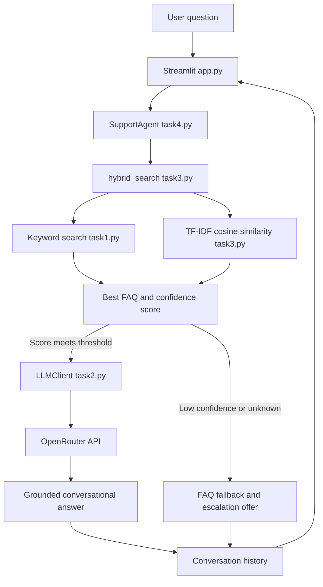
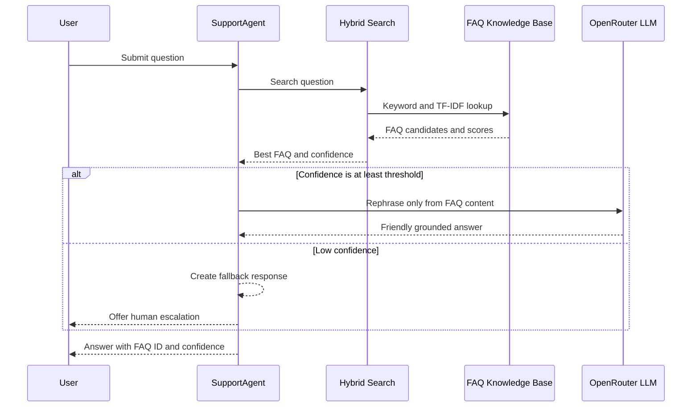

# SupportAI Helpdesk Assistant

A grounded customer-support assistant built with Python, Streamlit, TF-IDF FAQ matching, hybrid search, and the OpenRouter LLM API.

SupportAI answers questions from a controlled FAQ knowledge base, gives each match a confidence score, and can escalate uncertain requests to human support.

## Live Application

- GitHub: [J-harshavardhan/Support_AI_Assistant](https://github.com/J-harshavardhan/Support_AI_Assistant)
- Streamlit deployment: [SupportAI Helpdesk](https://harsha-support-ai-assistant.streamlit.app/)

The Streamlit URL may change if the app name is updated in Streamlit Community Cloud.

## What It Does

SupportAI handles common helpdesk questions such as:

- Password resets and account access
- Order and package tracking
- Refund and billing policies
- Customer support contact details
- Subscription cancellation
- Shipping and package delivery
- Email address updates

The assistant does not depend only on exact phrase matching. It combines keyword search with TF-IDF similarity so that questions such as `I forgot my login credentials` can find the password-reset FAQ even when the wording is different.

## Project Architecture



## Four-Task Structure

| File | Responsibility |
| --- | --- |
| `task1.py` | FAQ data, keyword search, ID lookup, and category lookup |
| `task2.py` | OpenRouter configuration, API client, error handling, and grounded prompts |
| `task3.py` | TF-IDF matching, cosine similarity, confidence thresholds, and hybrid search |
| `task4.py` | Conversational agent, history, fallback handling, escalation, and CLI demo |
| `app.py` | Streamlit web interface for the complete agent |
| `requirements.txt` | Python dependencies |
| `.env` | Local API key configuration; ignored by Git |

## Request Flow



## Key Features

### Grounded FAQ answers

The LLM receives the selected FAQ question, official answer, and the user question. Its system instructions require it to:

- Use only the supplied FAQ content
- Keep the answer professional and concise
- Avoid inventing policies, prices, dates, or steps
- Explain when the FAQ does not cover a requested detail

### Hybrid matching

The search layer combines two approaches:

1. Task 1 keyword hits receive a base score of `0.5`.
2. Task 3 calculates TF-IDF cosine similarity.
3. Duplicate FAQ results are merged by ID.
4. The highest score is retained for each FAQ.
5. Results are sorted from highest to lowest confidence.

The default agent confidence threshold is `0.15`.

### Conversation state

`SupportAgent` stores each user and assistant turn using the `ConversationTurn` dataclass. Each assistant answer can include:

- FAQ ID
- Confidence score
- Response content

The agent also tracks repeated low-confidence questions and can create a mock support ticket such as `TICKET-48291`.

### API failure resilience

If OpenRouter is unavailable, returns an authorization/payment error, or the API key is missing, the agent:

- Logs the actual technical error for debugging
- Preserves the matched FAQ ID and confidence score
- Displays the official FAQ answer instead of failing silently

## Technology Stack

- Python 3.14
- Streamlit
- Requests
- Python Dotenv
- Scikit-learn
- OpenRouter-compatible chat completions API
- `openai/gpt-4o-mini` or another available OpenRouter model configured in `task2.py`

## Local Setup

### 1. Clone the repository

```bash
git clone https://github.com/J-harshavardhan/Support_AI_Assistant.git
cd Support_AI_Assistant
```

### 2. Create or use a virtual environment

Windows Command Prompt:

```bat
python -m venv .venv
.venv\Scripts\activate
```

PowerShell:

```powershell
python -m venv .venv
.\.venv\Scripts\Activate.ps1
```

### 3. Install dependencies

```bash
python -m pip install -r requirements.txt
```

### 4. Configure the API key

Create a local `.env` file in the project root:

```env
OPENROUTER_API_KEY=your_new_openrouter_key
```

Never commit `.env`, paste the key into source code, or publish the key in screenshots. The repository already ignores `.env` and `.venv`.

### 5. Run the web application

```bash
streamlit run app.py
```

Open the local URL shown by Streamlit, usually:

```text
http://localhost:8501
```

If that port is occupied, Streamlit will use another available port.

## Running Individual Tasks

Task 1, FAQ data and keyword search:

```bash
python task1.py
```

Task 2, OpenRouter demonstration:

```bash
python task2.py
```

Task 3, keyword versus TF-IDF versus hybrid comparison:

```bash
python task3.py
```

Task 4, command-line helpdesk agent:

```bash
python task4.py
```

## Web App Controls

- Enter a question in the chat box and press Enter.
- Use the sidebar suggested questions for quick testing.
- Use **New conversation** to clear the current session.
- Use **Escalate to human support** to create a mock ticket.
- Search the FAQ index by category, question, or keyword.
- Collapse the sidebar when you want a focused chat-only view.

## Streamlit Community Cloud Deployment

1. Open [Streamlit Community Cloud](https://share.streamlit.io)
2. Sign in with GitHub.
3. Select repository `J-harshavardhan/Support_AI_Assistant`.
4. Select branch `main`.
5. Set the main file to `app.py`.
6. Open **Advanced settings**.
7. Add the secret in TOML format:

```toml
OPENROUTER_API_KEY = "your_new_openrouter_key"
```

1. Click **Save**, then **Deploy** or **Reboot app**.

The application reads the key from Streamlit Cloud Secrets in deployment and from `.env` during local development.

## Security Notes

- API keys must stay in environment variables or Streamlit Secrets.
- If a key is exposed in a screenshot, terminal output, chat, or commit, revoke it immediately and create a replacement.
- `.env`, `.venv`, Python caches, and compiled files are ignored by Git.
- Do not expose the full API key in logs or debugging output.

## Troubleshooting

### The app says the API key is missing

Check that the local `.env` contains:

```env
OPENROUTER_API_KEY=your_new_openrouter_key
```

For Streamlit Cloud, check **App settings → Secrets** and use TOML syntax:

```toml
OPENROUTER_API_KEY = "your_new_openrouter_key"
```

Then reboot the deployed app.

### OpenRouter returns 401

The key is invalid, expired, revoked, or not available to the selected account. Create a new key and update the local `.env` and Streamlit Cloud Secret.

### OpenRouter returns 402

The account may have no available credits for the selected model. Add credits or choose an available free model in `task2.py`.

### The app matches an FAQ but cannot generate an LLM answer

The FAQ matching and fallback system can still display the official answer. The technical API error is logged for diagnosis, while the user sees the verified FAQ content.

### Port 8501 is already in use

Run Streamlit on another port:

```bash
streamlit run app.py --server.port 8502
```

## Example Conversation

```text
You: I forgot my login credentials

SupportAI:
Click 'Forgot Password' on the login page. Enter your registered email
address and check your inbox for a reset link valid for 24 hours.

FAQ: faq-001 · Confidence: 0.50
```

## Validation

The project has been validated with:

- Python compilation checks across Tasks 1–4 and `app.py`
- Task 1 keyword search demonstrations
- Task 3 TF-IDF and hybrid search assertions
- Task 4 mocked LLM orchestration tests
- Missing-key and OpenRouter-error fallback tests
- Streamlit startup checks

## License

This project was created for educational and assessment purposes.
