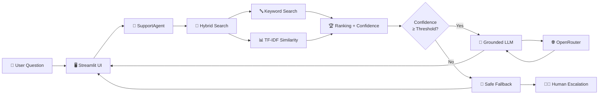
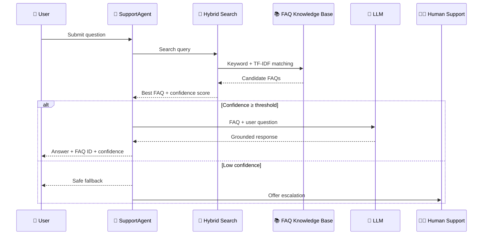

# 🤖 SupportAI — Grounded Helpdesk Assistant

<p align="center">

**An AI-powered customer support assistant that answers from a controlled FAQ knowledge base — with hybrid retrieval, confidence scoring, grounded LLM responses, and human escalation.**

<br/>

<a href="https://harsha-support-ai-assistant.streamlit.app/">
  <strong>🚀 Live Demo</strong>
</a>
&nbsp;&nbsp;•&nbsp;&nbsp;
<a href="https://github.com/J-harshavardhan/Support_AI_Assistant">
  <strong>💻 GitHub Repository</strong>
</a>

</p>

---

## ✨ Overview

**SupportAI** is a grounded customer-support assistant built with **Python, Streamlit, TF-IDF, hybrid search, and the OpenRouter API**.

Instead of sending every user question directly to an LLM, SupportAI first searches a controlled FAQ knowledge base and calculates a confidence score.

Only sufficiently relevant FAQ matches are passed to the LLM for conversational rephrasing.

When the system cannot confidently identify a relevant FAQ, it avoids guessing and instead provides a safe fallback with an option to escalate the request to human support.

### 🎯 Core Design Principle

> **Retrieve first. Generate second. Escalate when uncertain.**

This makes the system more predictable and reduces the risk of unsupported answers.

---

## 🌐 Live Demo

### 🚀 Try SupportAI

**Live Application:**
https://harsha-support-ai-assistant.streamlit.app/

**Source Code:**
https://github.com/J-harshavardhan/Support_AI_Assistant

The application is deployed using **Streamlit Community Cloud**.

---

# 🧠 How SupportAI Works



---

# 🔄 Request Lifecycle



---

# 🔍 Hybrid Search Pipeline

SupportAI combines **lexical keyword matching** with **TF-IDF semantic-style similarity**.

```text
                    USER QUESTION
                         │
                         ▼
                ┌─────────────────┐
                │ Query Processing │
                └────────┬────────┘
                         │
             ┌───────────┴───────────┐
             ▼                       ▼
      🔤 Keyword Search       📊 TF-IDF Search
             │                       │
             │ Base Score            │ Cosine
             │ = 0.50               │ Similarity
             │                       │
             └───────────┬───────────┘
                         ▼
                ┌─────────────────┐
                │ Result Merging  │
                │   by FAQ ID     │
                └────────┬────────┘
                         ▼
                ┌─────────────────┐
                │ Score Ranking   │
                └────────┬────────┘
                         ▼
                🏆 Best FAQ Match
                         │
                         ▼
                Confidence Check
                   /          \
                 HIGH          LOW
                  │             │
                  ▼             ▼
             Grounded LLM    Safe Fallback
                  │             │
                  ▼             ▼
              Answer        Human Support
```

### Matching Strategy

| Stage             | Function                                    |
| ----------------- | ------------------------------------------- |
| 🔤 Keyword Search | Detects direct keyword matches              |
| 📊 TF-IDF         | Measures textual similarity                 |
| 🔀 Hybrid Search  | Combines candidate results                  |
| 🏆 Ranking        | Selects the strongest FAQ match             |
| 🎯 Confidence     | Determines whether the answer is reliable   |
| 🧠 LLM            | Rephrases the verified FAQ conversationally |
| 🛟 Fallback       | Prevents unsupported answers                |

The current implementation uses a default agent confidence threshold of **0.15**.

---

# ⭐ Key Features

### 📚 Grounded Knowledge

The LLM receives:

* User question
* Matched FAQ question
* Official FAQ answer

The model is instructed to answer **only from the supplied FAQ content**.

It should not invent:

* ❌ Policies
* ❌ Prices
* ❌ Dates
* ❌ Procedures
* ❌ Unsupported information

---

### 🔎 Hybrid FAQ Retrieval

SupportAI does not depend on exact phrase matching.

For example:

```text
User:
"I forgot my login credentials"

        ↓

Keyword / TF-IDF Matching

        ↓

faq-001
Password Reset

        ↓

Grounded Answer
```

This allows differently worded questions to retrieve the same underlying FAQ.

---

### 🎯 Confidence Scoring

Every matched FAQ can be accompanied by a confidence score.

Example:

```text
FAQ: faq-001
Confidence: 0.50
```

The score helps determine whether the system should:

```text
CONFIDENT
   │
   ▼
Generate grounded response
```

or:

```text
UNCERTAIN
   │
   ▼
Fallback + escalation
```

---

### 💬 Conversation State

The `SupportAgent` maintains conversation history using the `ConversationTurn` dataclass.

Each assistant response can contain:

```text
FAQ ID
Confidence Score
Response Content
```

The system also tracks repeated low-confidence requests and can create a mock support ticket such as:

```text
TICKET-48291
```

---

### 🛟 Human Escalation

When SupportAI cannot confidently answer a question, it does not attempt to fabricate an answer.

Instead:

```text
Unknown / Low Confidence
          ↓
     Safe Fallback
          ↓
 Offer Human Support
          ↓
   Mock Ticket Created
```

This provides a controlled failure path.

---

### 🧯 API Failure Resilience

If the OpenRouter API:

* Is unavailable
* Returns an authorization error
* Returns a payment/credit error
* Has a missing API key

the application can fall back to the verified FAQ answer.

The system preserves useful metadata such as:

```text
FAQ ID
Confidence Score
Official FAQ Answer
```

while logging the technical error for debugging.

---

# 🏗️ Project Architecture

```text
Support_AI_Assistant/
│
├── 📄 app.py
│   └── Streamlit web application
│
├── 📄 task1.py
│   └── FAQ knowledge base + keyword search
│
├── 📄 task2.py
│   └── OpenRouter LLM client + grounded prompts
│
├── 📄 task3.py
│   └── TF-IDF + cosine similarity + hybrid search
│
├── 📄 task4.py
│   └── SupportAgent + history + fallback + escalation
│
├── 📄 requirements.txt
│   └── Python dependencies
│
├── 🔐 .env
│   └── Local API configuration
│
└── 📄 README.md
    └── Project documentation
```

---

# 🧩 Component Responsibilities

| Component          | Responsibility                                           |
| ------------------ | -------------------------------------------------------- |
| `app.py`           | Streamlit UI and user interaction                        |
| `task1.py`         | FAQ data, keyword search, ID/category lookup             |
| `task2.py`         | OpenRouter configuration, API client, grounded prompting |
| `task3.py`         | TF-IDF, cosine similarity, confidence and hybrid ranking |
| `task4.py`         | Conversational agent, history, fallback and escalation   |
| `requirements.txt` | Python dependencies                                      |
| `.env`             | Local API credentials                                    |

---

# 🛠️ Technology Stack

| Technology       | Purpose                             |
| ---------------- | ----------------------------------- |
| 🐍 Python        | Application and AI logic            |
| 🎈 Streamlit     | Web interface                       |
| 📊 Scikit-learn  | TF-IDF and cosine similarity        |
| 🌐 OpenRouter    | LLM API                             |
| 🔗 Requests      | HTTP/API communication              |
| 🔐 Python Dotenv | Environment configuration           |
| 🧠 LLM           | Grounded natural-language responses |

---

# 💻 Example Conversation

```text
┌─────────────────────────────────────────────┐
│ 👤 USER                                     │
├─────────────────────────────────────────────┤
│ I forgot my login credentials               │
└─────────────────────────────────────────────┘

                    ↓

┌─────────────────────────────────────────────┐
│ 🔎 HYBRID SEARCH                            │
├─────────────────────────────────────────────┤
│ FAQ: faq-001                                │
│ Category: Account Access                    │
│ Confidence: 0.50                            │
└─────────────────────────────────────────────┘

                    ↓

┌─────────────────────────────────────────────┐
│ 🤖 SUPPORTAI                                │
├─────────────────────────────────────────────┤
│ Click "Forgot Password" on the login page. │
│ Enter your registered email address and     │
│ check your inbox for the reset link.       │
│                                             │
│ FAQ: faq-001                                │
│ Confidence: 0.50                            │
└─────────────────────────────────────────────┘
```

---

# 🖥️ Application Screenshots

> Add screenshots of the deployed Streamlit application here.

Recommended screenshots:

### 1. 💬 Main Chat Interface

```text
[ Streamlit Chat UI Screenshot ]
```

Show:

* Chat interface
* User question
* AI response
* FAQ ID
* Confidence score

### 2. 🔎 FAQ Search

```text
[ FAQ Search Screenshot ]
```

Show:

* FAQ categories
* Search functionality
* Matching results

### 3. 🛟 Human Escalation

```text
[ Escalation Screenshot ]
```

Show:

* Low-confidence request
* Escalation button
* Generated support ticket

### 4. 📊 Search Comparison

```text
[ Keyword vs TF-IDF vs Hybrid Screenshot ]
```

Show how different retrieval strategies rank the same query.

---

# 🚀 Local Installation

## 1. Clone the repository

```bash
git clone https://github.com/J-harshavardhan/Support_AI_Assistant.git

cd Support_AI_Assistant
```

## 2. Create a virtual environment

### Windows CMD

```bat
python -m venv .venv
.venv\Scripts\activate
```

### PowerShell

```powershell
python -m venv .venv
.\.venv\Scripts\Activate.ps1
```

## 3. Install dependencies

```bash
python -m pip install -r requirements.txt
```

## 4. Configure OpenRouter

Create a `.env` file in the project root:

```env
OPENROUTER_API_KEY=your_new_openrouter_key
```

### ⚠️ Security

Never commit:

```text
.env
API keys
Access tokens
Credentials
```

Do not expose API keys in:

* GitHub commits
* Screenshots
* Terminal output
* README files
* Source code

If a key is exposed, **revoke it immediately and generate a replacement**.

---

# ▶️ Run the Application

Start Streamlit:

```bash
streamlit run app.py
```

The application normally starts at:

```text
http://localhost:8501
```

If the port is already occupied:

```bash
streamlit run app.py --server.port 8502
```

---

# 🧪 Run Individual Tasks

### Task 1 — FAQ & Keyword Search

```bash
python task1.py
```

### Task 2 — OpenRouter LLM

```bash
python task2.py
```

### Task 3 — Search Comparison

```bash
python task3.py
```

Compares:

```text
Keyword Search
       ↓
TF-IDF Search
       ↓
Hybrid Search
```

### Task 4 — CLI Support Agent

```bash
python task4.py
```

---

# ☁️ Streamlit Deployment

SupportAI can be deployed using **Streamlit Community Cloud**.

### Deployment flow

```text
GitHub Repository
       │
       ▼
Streamlit Community Cloud
       │
       ▼
Select main branch
       │
       ▼
Set app.py
       │
       ▼
Add OPENROUTER_API_KEY
       │
       ▼
      Deploy
       │
       ▼
🌐 Live SupportAI Application
```

For deployment secrets, use:

```toml
OPENROUTER_API_KEY = "your_new_openrouter_key"
```

Do not place the actual API key inside the repository.

---

# 🧪 Validation

The project has been tested across several layers:

| Validation Area           | Status |
| ------------------------- | ------ |
| Python compilation        | ✅      |
| Keyword search            | ✅      |
| TF-IDF matching           | ✅      |
| Hybrid search             | ✅      |
| Mocked LLM orchestration  | ✅      |
| Missing API-key fallback  | ✅      |
| OpenRouter error handling | ✅      |
| Streamlit startup         | ✅      |

---

# 📌 Supported Helpdesk Topics

SupportAI currently demonstrates FAQ handling for areas such as:

```text
🔐 Account Access
📦 Order Tracking
🚚 Shipping
💳 Billing
💰 Refunds
📧 Email Updates
🔄 Subscription Cancellation
☎️ Customer Support
```

The FAQ knowledge base can be extended with additional categories and entries.

---

# ⚠️ Limitations

SupportAI is intentionally designed around a **controlled FAQ knowledge base**.

Current limitations include:

* The knowledge base is relatively small.
* Retrieval quality depends on the FAQ corpus.
* TF-IDF is lexical rather than embedding-based semantic retrieval.
* Human escalation is currently represented by a mock ticket workflow.
* LLM availability depends on the configured OpenRouter model/API.
* Confidence scores should be interpreted as retrieval scores, not calibrated probabilities.

---

# 🔮 Future Improvements

Potential improvements include:

### Retrieval

* [ ] Replace TF-IDF with embedding-based retrieval
* [ ] Add vector database support
* [ ] Add reranking
* [ ] Improve query normalization
* [ ] Add multilingual FAQ retrieval

### AI

* [ ] Structured LLM responses
* [ ] Better grounding verification
* [ ] Hallucination detection
* [ ] Intent classification
* [ ] Automatic confidence calibration

### Support Operations

* [ ] Real ticket-management integration
* [ ] Ticket priority prediction
* [ ] Customer identity verification
* [ ] Agent dashboard
* [ ] Conversation analytics

### Production

* [ ] Authentication
* [ ] Database-backed conversation history
* [ ] Observability and logging
* [ ] Automated tests in CI/CD
* [ ] Rate limiting
* [ ] Production monitoring

---

# 🎓 Project Objective

This project demonstrates how a customer-support assistant can combine:

```text
Information Retrieval
        +
Machine Learning
        +
Large Language Models
        +
Confidence-Based Routing
        +
Human Escalation
```

The key objective is not simply to generate an answer with an LLM.

Instead, SupportAI demonstrates a more controlled architecture:

> **Find trusted information → measure confidence → generate only from retrieved information → safely escalate when uncertain.**

---

# 📚 Learning Outcomes

This project demonstrates practical experience with:

* Python application development
* Streamlit UI development
* Information retrieval
* TF-IDF vectorization
* Cosine similarity
* Hybrid search
* LLM API integration
* Prompt grounding
* Conversation state
* Error handling
* Fallback architecture
* Environment-variable security
* Cloud deployment

---

# 📄 License

This project was created for **educational and assessment purposes**.

---

<p align="center">

### 🤖 SupportAI

**Grounded answers. Confidence-aware retrieval. Safe escalation.**

Built with ❤️ using Python, Streamlit, Scikit-learn and OpenRouter.

</p>
